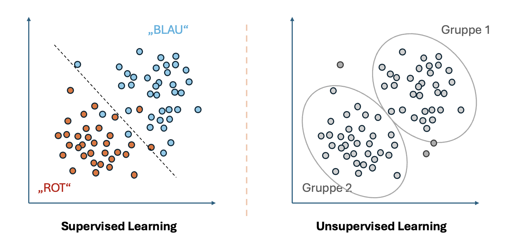
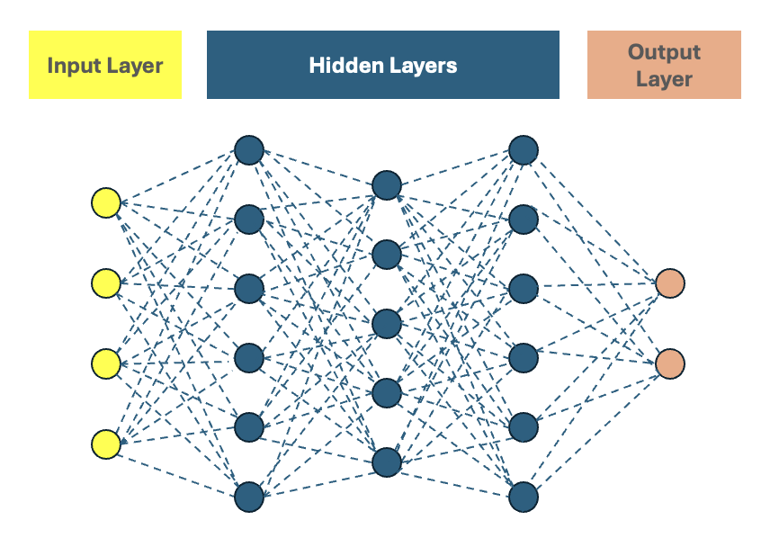

Maschinelles Lernen (ML): Konzepte und Typen
============================================

.. note::
.. https://www.python4data.science/de/latest/productive/dvc/dag.html

Was ist **Maschinellen Lernens (Machine Learning)**? 

Maschinelles Lernen (Machine Learning, ML) ist ein Teilgebiet der Künstlichen
Intelligenz, das es Computern ermöglicht, aus Daten zu lernen, anstatt explizit
programmiert zu werden. Es gibt drei Hauptarten des ML:

1. Überwachtes Lernen (Supervised Learning)
~~~~~~~~~~~~~~~~~~~~~~~~~~~~~~~~~~~~~~~~

Beim **überwachten Lernen** werden Modelle mit **gelabelten Daten** trainiert.

Das bedeutet, dass für jeden Eingabedatensatz ein bekanntes **Ziel** existiert.

Das Ziel des Modells ist es, eine Funktion zu lernen, die den Zusammenhang
zwischen Eingaben und Ausgaben erfasst.

Überwachtes Lernen kann sowohl für Regression als auch für Klassifikation
genutzt werden.

Beispiele hierfür sind:

Klassifikation
    Vorhersage diskreter Kategorien (:abbr:`z.B. (zum Beispiel)` Spam-Filter,
    Bilderkennung von Hunden und Katzen).
Regression
    Vorhersage kontinuierlicher Werte (:abbr:`z.B. (zum Beispiel)`
    Hauspreisvorhersage anhand der Wohnfläche).

Theoretische Konzepte des überwachten Lernens
:::::::::::::::::::::::::::::::::::::::::::::

Trainingsprozess
................

* Das Modell wird mit einem Trainingsdatensatz trainiert, in dem **Eingaben
  (Features)** und die zugehörigen **Zielwerte (Labels)** bekannt sind.
* Die Lernfunktion (oft als **Hypothesenfunktion** bezeichnet) wird durch das
  Training optimiert.

Modellbewertung
...............

* Das trainierte Modell wird anhand neuer Daten getestet, um sicherzustellen,
  dass es generalisiert und nicht nur die Trainingsdaten auswendig gelernt hat.
* Typische Metriken: Genauigkeit, Präzision, Recall und F1-Score, Mean Squared
  Error (MSE).

2. Unüberwachtes Lernen (Unsupervised Learning)
~~~~~~~~~~~~~~~~~~~~~~~~~~~~~~~~~~~~~~~~~~~~

Beim **unüberwachten Lernen** gibt es **keine gelabelten Daten**.

Das Modell versucht, Muster oder Strukturen in den Daten zu entdecken.

Dies eignet sich besonders für **Explorative Datenanalyse**, bei der keine
festen Kategorien bekannt sind.

Unüberwachtes Lernen kann direkt für Klassifikationsprobleme genutzt werden;
aber nur indirekt für Regressionsprobleme, :abbr:`z.B. (zum Beispiel)` als
Vorverarbeitungsschritt oder zur Merkmalextraktion, um Regression effektiver zu
machen.

Typische Anwendungen sind:

Clustering
    Ziel: Datenpunkte in Gruppen einteilen, basierend auf Ähnlichkeit.

    Beispiele:

    * Kundensegmentierung für personalisierte Werbung.
    * Erkennung von ähnlichen Produkten in Online-Shops.
    * Gruppierung von genetischen Mustern in der Biologie.
    * Betrugserkennung durch Anomalie-Analyse in Banktransaktionen.

Dimensionsreduktion
    Ziel: Komplexe Daten in eine einfachere Form umwandeln.

    Beispiele:

    * Hauptkomponentenanalyse (PCA) zur Reduzierung hochdimensionaler Daten.
    * Visualisierung von großen Datenmengen.
    * Feature-Auswahl für effizientere Modellberechnungen.

Theoretische Konzepte des Unüberwachten Lernens
:::::::::::::::::::::::::::::::::::::::::::::::

Clustering-Algorithmen
......................

K-Means
    teilt Daten in eine vordefinierte Anzahl von Clustern ein.
Hierarchisches Clustering
    erstellt eine baumartige Struktur zur Clusterbildung.
DBSCAN
    erkennt Cluster basierend auf der Dichte der Datenpunkte.

Dimensionsreduktionstechniken
.............................

PCA (Principal Component Analysis)
    extrahiert die wichtigsten Variablen aus großen Datensätzen.

t-SNE (t-Distributed Stochastic Neighbor Embedding)
    visualisiert komplexe Datensätze in 2D oder 3D.

Vergleich: Überwachtes vs. Unüberwachtes Lernen
~~~~~~~~~~~~~~~~~~~~~~~~~~~~~~~~~~~~~~~~~~~~~~~~

   **Abbildung 1:** Überwachtes Lernen vs. Unüberwachtes Lernen 

.. list-table:: Vergleich von Überwachtem und Unüberwachtem Lernen
  :header-rows: 1

  * - Merkmal
    - Überwachtes Lernen
    - Unüberwachtes Lernen
  * - Datenverfügbarkeit
    - Gelabelte Daten notwendig
    - Keine Labels erforderlich
  * - Ziel
    - Vorhersage einer bekannten Zielvariable
    - Identifikation von Mustern oder Strukturen
  * - Typische Algorithmen
    - Lineare Regression, Entscheidungsbäume, Neuronale Netze
    - K-Means, DBSCAN, PCA
  * - Anwendungsbereiche
    - Klassifikation, Regression
    - Clustering, Dimensionsreduktion

3. Reinforcement Learning (Bestärkendes Lernen, RL)
~~~~~~~~~~~~~~~~~~~~~~~~~~~~~~~~~~~~~~~~~~~~~~~~

.. seealso::
   * :doc:`../3reinforce_learn/index`

Definition
::::::::::

Beim **Reinforcement Learning** (Bestärkenden Lernen, RL) lernt ein Agent durch
**Interaktion mit einer Umgebung**, wobei er **Belohnungen oder Bestrafungen**
erhält.

Das Ziel des RL ist es, eine **Optimierungsstrategie** zu entwickeln, die
langfristig die höchste Gesamtbelohnung erzielt.

Es handelt sich um eine Form des **Lernens durch Versuch und Irrtum**, ähnlich
wie ein Mensch, der durch Erfahrung lernt.

Grundprinzipien von Reinforcement Learning
::::::::::::::::::::::::::::::::::::::::::

Beim Reinforcement Learning wird ein "Agent" definiert, z.B. Roboter, der sich innerhalb einer Umgebung, z.B. in einem Raum, sich zurechtfinden soll, mit einem klar definierten Ziel vor dem Auge, z.B. den Ausgang zu finden. 
Der Agent bekommt keine klare Schrittreihenfolge vorgeschrieben, sondern hat Anweisungen für schrittweises Handeln und muss selbst herausfinden, wie er sich am besten zum Ziel kommt.   

Auf Details gehen wir in einem späteren Abschnitt dieser Schulung ein. 

.. Agent
    Das KI-System, das lernt (:abbr:`z.B. (zum Beispiel)` ein Roboter, ein
    autonomes Auto, ein Schachprogramm).
.. Umgebung (Environment)
    Alles außerhalb des Agents, mit dem er interagiert.
.. Zustand (State)
    Eine Momentaufnahme der Umgebung, die den Agenten beeinflusst.
.. Aktion (Action)
    Eine Entscheidung, die der Agent in einem bestimmten Zustand trifft.
.. Belohnung (Reward)
    Eine numerische Bewertung der Aktion, die dem Agenten signalisiert, ob er
    sich der optimalen Lösung nähert oder nicht.
.. Richtlinien (Policy)
    Eine Strategie, die den besten nächsten Schritt für den Agenten bestimmt.
.. Qualitäts-Wert (Q-Value)
    Eine Bewertung, wie gut eine bestimmte Aktion in einem Zustand langfristig
    ist.

Beispiele für RL-Anwendungen
::::::::::::::::::::::::::::

Spielstrategien:
    AlphaGo von DeepMind besiegte menschliche Meister im Go-Spiel durch RL.
Autonome Fahrzeuge:
    Lernen, sicher zu fahren, indem sie Belohnungen für sichere Entscheidungen
    erhalten.
Robotik:
    Industrieroboter optimieren ihre Bewegungen, um Aufgaben effizienter zu
    erledigen.
Algorithmischer Handel:
    KI-Agenten lernen, wann sie Aktien kaufen oder verkaufen sollen.

Wichtige RL-Algorithmen
:::::::::::::::::::::::

Q-Learning:
    Eine tabellenbasierte Methode zur Speicherung der besten Aktionen.
Deep Q-Networks (DQN):
    Eine Erweiterung von Q-Learning unter Verwendung von neuronalen Netzen.
Policy-Gradient-Verfahren:
    Statt Werte zu lernen, lernt das Modell direkt eine optimale Strategie.
Proximal Policy Optimization (PPO):
    Häufig in modernen RL-Anwendungen eingesetzt (z. B. bei OpenAI Gym).

Herausforderungen im RL
:::::::::::::::::::::::

Exploration vs. Exploitation:
    Ein Agent muss entscheiden, ob er eine **neue Strategie** testet oder eine
    **bereits bekannte, aber möglicherweise nicht optimale** Strategie nutzt.
Belohnungsdesign:
    Ein schlecht definierter Belohnungsmechanismus kann dazu führen, dass das
    Modell unerwartete oder unerwünschte Strategien lernt.
Rechenaufwand:
    RL benötigt oft viele Trainingsdurchläufe und Rechenleistung.

4. Deep Learning (DL) als spezialisierte Form des ML
~~~~~~~~~~~~~~~~~~~~~~~~~~~~~~~~~~~~~~~~~~~~~~~~~

Definition
::::::::::

Deep Learning (DL) ist ein Teilgebiet des maschinellen Lernens, das auf
**künstlichen neuronalen Netzen (KNNs)** basiert.

Es verwendet **mehrere Schichten von Neuronen** (daher der Begriff „Deep“), um
hochkomplexe Muster in Daten zu lernen.

Deep Learning ist besonders leistungsfähig bei **Bildverarbeitung,
Spracherkennung und natürlicher Sprachverarbeitung (NLP).**

Aufbau eines neuronalen Netzes
::::::::::::::::::::::::::::::

Input Layer
    Nimmt Daten auf (:abbr:`z.B. (zum Beispiel)` Pixelwerte eines Bildes).
Verborgene Schichten (Hidden Layers)
    Extrahieren Merkmale und erkennen Muster.
Ausgangsschicht (Output Layer)
    Gibt das Ergebnis der Berechnung aus (:abbr:`z.B. (zum Beispiel)`
    Klassifizierung in „Hund“ oder „Katze“).

   **Abbildung 1:** Neural Network grober Aufbau 

Arten von neuronalen Netzwerken
:::::::::::::::::::::::::::::::

Feedforward Neural Networks (FNN)
    Einfachste Form, bei der Informationen nur in eine Richtung fließen.
Convolutional Neural Networks (CNN)
    Besonders geeignet für **Bildverarbeitung** (:abbr:`z.B. (zum Beispiel)`
    Gesichtserkennung, medizinische Bilddiagnostik).
Recurrent Neural Networks (RNN)
    Nutzen vergangene Informationen zur Verarbeitung von **sequenziellen Daten**
    (:abbr:`z.B. (zum Beispiel)` Sprachverarbeitung, Zeitreihenanalyse).
Transformer-Modelle
    Revolutionierten die **Natürliche Sprachverarbeitung (NLP)** (:abbr:`z.B.
    (zum Beispiel)` GPT-Modelle, BERT, T5).

Beispiele für Anwendungen von Deep Learning
:::::::::::::::::::::::::::::::::::::::::::

Bilderkennung:** Automatische Erkennung von Objekten in Bildern.

Sprachverarbeitung (NLP)
    Chatbots, automatische Übersetzungen (Google Translate, ChatGPT).
Autonome Systeme
    Steuerung von selbstfahrenden Autos und Robotern.
Medizinische Diagnosen
    Krebsfrüherkennung in MRT-Scans mit neuronalen Netzen.

Herausforderungen im Deep Learning
::::::::::::::::::::::::::::::::::

Erklärbarkeit
    DL-Modelle sind oft **Black Boxes**, deren Entscheidungen schwer nachvollziehbar sind. 
    Früher hielt man generell alle Machine Learning Modelle für **Black Boxes**, aber dann hat man 
    für die "traditionellere" ML-Modelle Wege gefunden, dass man von den Modell-Gewichten zu den Features zurückführen kann,
    warum ein Modell diese Vorhersage getroffen hat, z.B. `shap <https://shap.readthedocs.io/en/latest/>`_ Bibliothek. 

Datenbedarf
    Sehr große Mengen an **Trainingsdaten** sind notwendig.
Rechenleistung
    DL benötigt leistungsfähige GPUs oder TPUs.

Zukunft von Deep Learning
:::::::::::::::::::::::::

Edge AI
    Deep Learning wird zunehmend auf Edge-Geräten (Smartphones, IoT-Geräte)
    ausgeführt.
Hybride Systeme
    Kombination von Deep Learning mit Reinforcement Learning für **komplexe
    Entscheidungsprozesse**.
Quanten-KI
    Erste Ansätze zur Beschleunigung von Deep-Learning-Modellen mit
    Quantencomputing.
