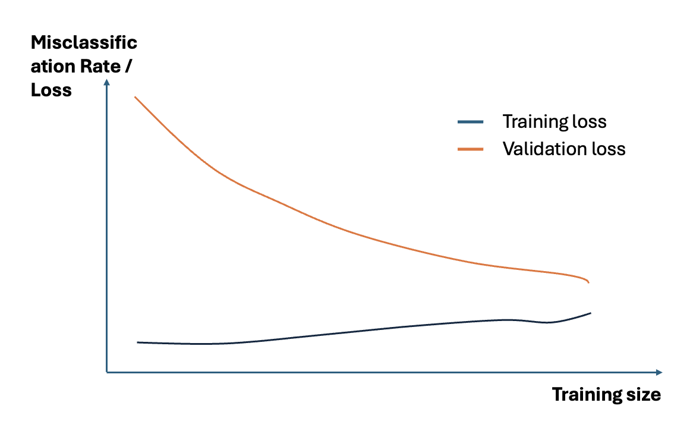
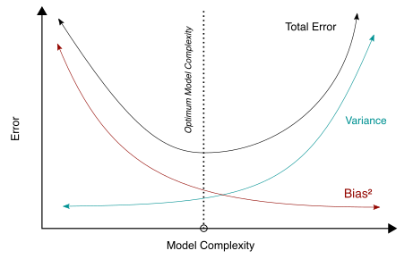

Modellverhalten: Overfitting, Regularisierung und Optimierung
================================================================

Einführung
---------------

Nachdem wir uns am ersten Tag mit **Regression und Klassifikation** beschäftigt haben, wenden wir uns nun einem zentralen Problem im maschinellen Lernen zu: 
**Wie stellen wir sicher, dass unser Modell nicht nur auf Trainingsdaten gut funktioniert, sondern auch auf unbekannte Daten?**

Dazu müssen wir drei wichtige Konzepte verstehen:

1. **Overfitting und Underfitting** – Wann ist ein Modell zu komplex oder zu einfach?
2. **Regularisierung** – Wie können wir Overfitting verhindern?

1. Overfitting und Underfitting
----------------------------------

Beim Training von ML-Modellen kann es vorkommen, dass ein Modell entweder **zu gut auf Trainingsdaten passt (Overfitting)** oder **nicht gut genug trainiert wird (Underfitting)**.

- **Overfitting** tritt auf, wenn das Modell die Trainingsdaten **zu stark auswendig lernt** und nicht auf neue Daten generalisiert.
- **Underfitting** tritt auf, wenn das Modell **zu simpel ist**, um die Muster in den Daten zu erfassen.

Underfitting
------------

**Underfitting** tritt auf, wenn ein Modell zu einfach ist, um die zugrunde liegenden Muster in den Daten zu erfassen. 
Dies geschieht oft, wenn das Modell zu wenige Parameter hat oder wenn es nicht ausreichend trainiert wurde. 
Ein unterangepasstes Modell zeigt sowohl auf den Trainingsdaten als auch auf den Testdaten hohe Fehlerwerte, weil es die Struktur der Daten nicht richtig abbilden kann. 
Ein typisches Beispiel ist die Verwendung einer linearen Regression für eine stark nicht-lineare Beziehung, wodurch das Modell die Zusammenhänge nicht ausreichend erfasst.

Overfitting
--------------

Overfitting ist eines der größten Probleme im maschinellen Lernen. 

Was ist Overfitting?
::::::::::::::::::::::::

Es tritt auf, wenn ein Modell die Trainingsdaten **zu stark auswendig lernt**, anstatt die zugrunde liegenden Muster zu erkennen. 
Dies führt dazu, dass das Modell auf neuen, unbekannten Daten schlecht generalisiert.

Das passiert leicht, wenn das ausgewählte und trainierte Modell zu komplex ist und sich **zu stark an den Trainingsdatensatz anpasst**, sodass es auf neuen Daten nicht mehr gut funktioniert. 

**Beispiel:**

Stellen wir uns vor, wir möchten den Zusammenhang zwischen der Körpergröße und dem Gewicht von Personen vorhersagen. 

- Ein einfaches Modell (z. B. lineare Regression) könnte sagen: **„Größere Menschen wiegen tendenziell mehr.“**
- Ein überangepasstes Modell könnte sich jedoch **zu stark an zufällige Ausreißer anpassen** und unnötig komplexe Regeln aufstellen wie: 

**„Personen mit einer Körpergröße von 1,78m wiegen exakt 73,2kg, aber bei 1,79m sinkt das Gewicht plötzlich auf 71,5kg.“**

Das überangepasste Modell wird zwar auf den Trainingsdaten eine sehr niedrige Fehlerquote haben, 
**aber es wird auf neuen, unbekannten Daten sehr schlecht funktionieren**.

   **Abbildung 1:** Overfitting, citation: By Chabacano - Own work, CC BY-SA 4.0, https://commons.wikimedia.org/w/index.php?curid=3610704

Eine gute Darstellung von Overfitting, Underfitting und einem gut generalisierten Modell kann `hier <https://de.mathworks.com/discovery/overfitting.html>`_ gefunden werden. 

Wie erkennt man überangepasste Modelle?
----------------------------------------

**Overfitting** ist nicht immer sofort sichtbar, aber es gibt einige **Hinweise**, anhand derer man es erkennen kann:

1. **Großer Unterschied zwischen Trainings- und Testfehler**
   - Wenn der Fehler auf den Trainingsdaten sehr niedrig, aber auf den Testdaten hoch ist, liegt meist Overfitting vor.

2. **Zu hohe Modellkomplexität**
   - Wenn ein Modell sehr viele Parameter (Gewichte) hat, ist das Risiko hoch, dass es Overfitting betreibt.

3. **Sehr gute Leistung auf bekannten, aber schlechte Leistung auf neuen Daten**
   - Wenn das Modell sich perfekt an die Trainingsdaten anpasst, aber auf neuen Daten katastrophale Fehler macht.

1. Trainings- und Testverlust:
:::::::::::::::::::::::::::::::

Definition
~~~~~~~~~~~~

**Training Loss (Trainingsverlust)**

Der Trainingsverlust ist eine Metrik, mit der bewertet wird, wie gut ein Deep-Learning-Modell zu den Trainingsdaten passt. Das heißt, er bewertet den Fehler des Modells in der Trainingsmenge. Beachten Sie, dass der Trainingssatz ein Teil eines Datensatzes ist, der für das anfängliche Training des Modells verwendet wird. Rechnerisch wird der Trainingsverlust durch die Summe der Fehler für jedes Beispiel im Trainingssatz berechnet.

Es ist auch wichtig zu beachten, dass der Trainingsverlust nach jedem Stapel gemessen wird. Dies wird in der Regel durch das Aufzeichnen einer Kurve des Trainingsverlustes veranschaulicht.

**Validierungsverlust (Validation Loss)**

Im Gegensatz dazu ist der Validierungsverlust eine Metrik, die verwendet wird, um die Leistung eines Deep-Learning-Modells auf dem Validierungsset zu bewerten. Der Validierungssatz ist ein Teil des Datensatzes, der beiseite gelegt wird, um die Leistung des Modells zu validieren. Der Validierungsverlust ist ähnlich wie der Trainingsverlust und wird aus der Summe der Fehler für jedes Beispiel im Validierungssatz berechnet.

Zusätzlich wird der Validierungsverlust nach jeder Epoche gemessen. Dies gibt Aufschluss darüber, ob das Modell weiter optimiert oder angepasst werden muss oder nicht. Zu diesem Zweck wird normalerweise eine Lernkurve für den Validierungsverlust erstellt.

Darstellung
~~~~~~~~~~~~

Eine typische Methode, um Overfitting zu erkennen, ist die **Lernkurve**, die zeigt, wie sich der Fehler für Trainings- und Testdaten über die Trainingszeit hinweg entwickelt:

   **Abbildung 3:** Lernkurve – Overfitting zeigt sich durch eine große Lücke zwischen Training- und Testfehler.

**Interpretation des Trainingsverlustes (Training Loss)** 

Die Lernkurve eines Overfit-Modells weist zu Beginn einen sehr niedrigen Training-Loss auf, der mit dem Hinzufügen von Trainingsbeispielen allmählich leicht ansteigt und nicht abflacht.

**Interpretieren des Validierungsverlustes (Validation Loss)**

Die Lernkurve eines Overfit-Modells weist zu Beginn einen hohen Validierungsverlust auf, der mit dem Hinzufügen von Trainingsbeispielen allmählich sinkt und nicht abflacht. 
Das deutet darauf hin, dass das Hinzufügen weiterer Trainingsbeispiele die Leistung des Modells bei ungesehenen Daten verbessern kann.
Es ist auch zu erkennen, dass die Trainings- und Validierungsverluste weit voneinander entfernt sind, die sich bei Hinzufügen zusätzlicher Trainingsdaten einander annähern können

2. Modelkomplexität
::::::::::::::::::::

Bei der Entscheidung der Modellkomplexität sind zwei Faktoren ausschlaggebend: 
**Bias** vs. **Varianz** 

**Bias**

Sei Y der wahre Wert eines Parameters, und sei 
Y hat sei ein Schätzer von Y auf der Grundlage einer Datenstichprobe. Dann ist die Verzerrung des Schätzers Y-hat ist gegeben durch:

   .. math::
      Bias(\hat{Y}) = E(\hat{Y}) - Y 

wobei 

.. math:: E(\hat{Y}) 
    
der Erwartungswert des Schätzers 

.. math:: \hat{Y} 

ist. Es ist die Messung des Modells, wie gut es zu den Daten passt. 

**Geringe Verzerrung:**

Eine geringe Verzerrung bedeutet, dass weniger Annahmen getroffen werden, um die Zielfunktion zu erstellen. 
In diesem Fall stimmt das Modell gut mit dem Trainingsdatensatz überein.
Hohe Verzerrung: Ein hoher Verzerrungswert bedeutet, dass mehr Annahmen zur Erstellung der Zielfunktion getroffen werden. 
In diesem Fall stimmt das Modell nicht genau mit dem Trainingsdatensatz überein. 

**Varianz**

Die Varianz ist ein Streuungsmaß. Sie ist das Quadrat der Standardabweichung und stellt die Werte-Verteilung um den Mittelwert herum dar. 
Berechnet wird die Varianz, indem die Summe der quadrierten Abweichungen aller Messwerte vom arithmetischen Mittel durch die Anzahl der Messwerte dividiert wird.

   .. math::
      Var(X) = \sigma^2 = \sum_{i=1}^{n} (x_i - \mu)^2 * p_i

Das Zusammenspiel zwischen Bias und Varianz in Bezug auf Modelkomplexität kann wiefolgt dargestellt werden:

   **Abbildung 1:** Modelkomplexität - Bias vs Varianz, citation: By Bigbossfarin - Own work, CC0, https://commons.wikimedia.org/w/index.php?curid=105307219

2. Regularisierung: Verhinderung von Overfitting
---------------------------------------------------------

Methoden zur Regularisierung:
:::::::::::::::::::::::::::::

* **Mehr Trainingsdaten verwenden**
   * Je mehr Daten ein Modell sieht, desto besser kann es generalisieren.
   * Besonders wichtig bei Deep Learning.

* **L1-Regularisierung (Lasso Regression)** 
   Setzt einige Koeffizienten auf 0, um unwichtige Merkmale zu eliminieren.

   .. math::
      L_1 = \sum{|x_i|} 

* **L2-Regularisierung (Ridge Regression)** 
   Bestraft große Koeffizienten, um ein stabileres Modell zu erzeugen.

   .. math::
      L_1 = \sqrt{\sum{{x_i}^2}}

* **Cross-Validation**
   * K-Fold Cross Validation hilft, das Modell auf mehreren Trainings/Test-Splits zu überprüfen.

* **Dropout (bei neuronalen Netzen)** 
   Deaktiviert zufällig einige Neuronen während des Trainings.

* **Early Stopping**
   * Stoppt das Training, sobald sich die Testfehler nicht weiter verbessern.

* **Datenaugmentierung** 
     Erhöht die Datenvielfalt (besonders nützlich in Computer Vision).

Code-Beispiel: Ridge & Lasso Regression
~~~~~~~~~~~~~~~~~~~~~~~~~~~~~~~~~~~~~~~~~~~

.. code-block:: python

   from sklearn.linear_model import Ridge, Lasso
   from sklearn.model_selection import train_test_split
   from sklearn.metrics import mean_squared_error

   # Trainings- und Testsplit
   X_train, X_test, y_train, y_test = train_test_split(X, y, test_size=0.2, random_state=42)

   # Ridge Regression
   ridge = Ridge(alpha=1.0)
   ridge.fit(X_train, y_train)
   y_pred_ridge = ridge.predict(X_test)

   # Lasso Regression
   lasso = Lasso(alpha=0.1)
   lasso.fit(X_train, y_train)
   y_pred_lasso = lasso.predict(X_test)

   # Fehlervergleich
   print("MSE Ridge:", mean_squared_error(y_test, y_pred_ridge))
   print("MSE Lasso:", mean_squared_error(y_test, y_pred_lasso))

Fazit & Ausblick
-----------------

* Overfitting kann Modelle unbrauchbar machen – Regularisierung hilft.
* Ridge und Lasso sind wichtige Werkzeuge für lineare Modelle.
