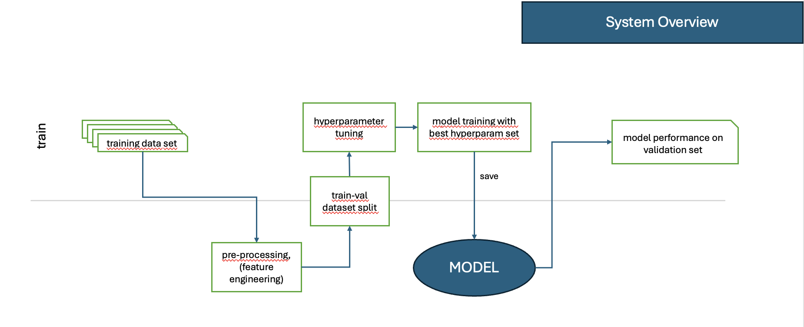
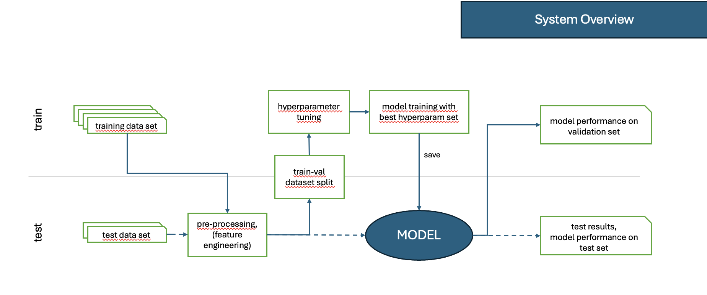
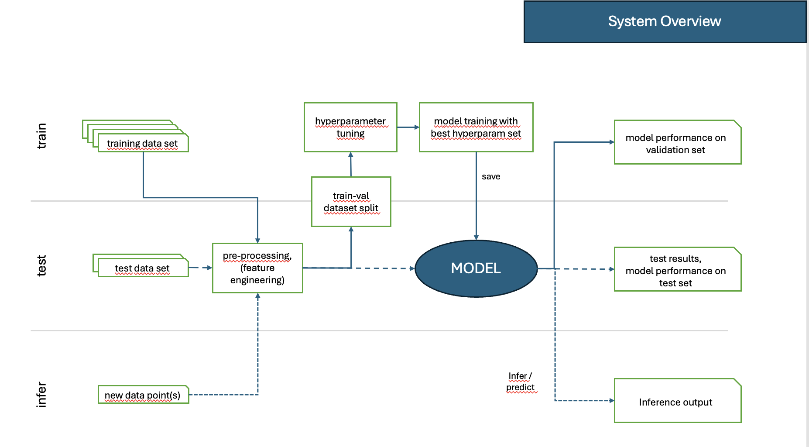
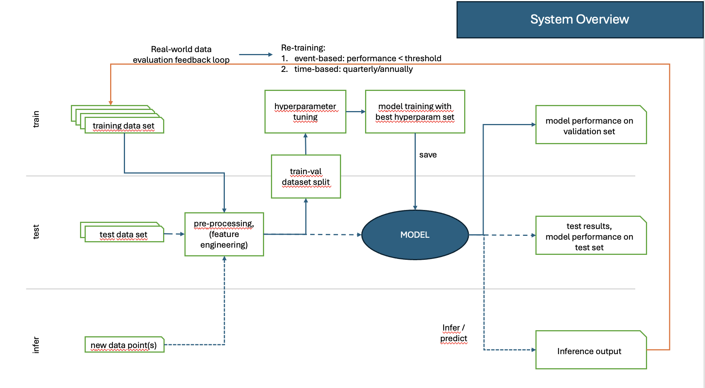

Tag 2: Vertiefung: Neuronale Netze, Deep Learning, Systemüberblick, Use Case Fallgruben 
==============================

**Recap Tag 1**

- Zusammenfassung der Konzepte aus Tag 1: Überwachtes, unüberwachtes und bestärkendes Lernen.

- Wichtige Begriffe: **Modell, Trainingsdaten, Testdaten, Overfitting, Regularisierung, Optimierung.**

- Diskussion der zentralen Herausforderungen im ML: **Bias, Datenqualität, Modellinterpretierbarkeit.**

- Offene Fragen und Klarstellungen

.. list-table:: Schulungsstruktur für Tag 2
   :header-rows: 1

   * - Kapitel
     - Inhalte
   * - Recap der wichtigsten Themen
     - Wiederholung der ML-Konzepte, Diskussion, Quiz
   * - Theorie: Neuronale Netze und Deep Learning
     - Aufbau, Backpropagation, Aktivierungsfunktionen
   * - Praxis: Bildklassifikation mit CNNs
     - Implementierung mit TensorFlow/Keras
   * - Diskussion: Use Case Fallgruben
     - Churn Prediction, Herausforderungen, Modellwahl

**Kapitel 9: Neuronale Netze und Deep Learning – Theorie**
----------------------------------------------------------
**Grundlagen:**

Was sind künstliche neuronale Netze? Wie unterscheiden sie sich von klassischen ML-Modellen?

- Künstliche neuronale Netze bestehen aus **Schichten von Neuronen**, die durch gewichtete Verbindungen miteinander verbunden sind.

- Aufbau eines neuronalen Netzes: **Eingabeschicht, versteckte Schichten, Aktivierungsfunktionen, Ausgangsschicht.**

- Jedes Neuron führt eine Berechnung basierend auf einer **Aktivierungsfunktion** durch und gibt das Ergebnis an die nächste Schicht weiter.

**Forwardpropagation (Vorwärtsdurchlauf):**

1. Die Eingabedaten werden in das Netzwerk eingespeist.

2. In jeder Schicht wird die gewichtete Summe der Eingänge berechnet:
   
   .. math::
      z = w_1 x_1 + w_2 x_2 + ... + w_n x_n + b
   
3. Diese gewichtete Summe wird durch eine **Aktivierungsfunktion** transformiert (z. B. ReLU, Sigmoid, Softmax), um **nicht-lineare Abhängigkeiten** abzubilden.

4. Die Ausgabe der einen Schicht wird als Eingabe an die nächste Schicht weitergegeben, bis die letzte Schicht erreicht ist.

5. Am Ende der Forward Propagation wird die Loss Function berechnet. 

**Loss Functions (Verlustfunktionen) und ihre Rolle:**

- Eine **Loss Function** misst die Differenz zwischen der Vorhersage des Modells und dem tatsächlichen Wert.

- Sie gibt an, wie gut oder schlecht das Modell arbeitet.

- Wird während der Backpropagation genutzt, um die Gewichte des Netzwerks zu aktualisieren.

**Typische Loss Functions:**

1. **Mean Squared Error (MSE)** – Wird für **Regressionsprobleme** verwendet:
   
   .. math::
      MSE = \frac{1}{n} \sum_{i=1}^{n} (y_i - \hat{y}_i)^2
   
   - Bestraft größere Fehler überproportional.

   - Gut für kontinuierliche Werte wie Preisprognosen.

2. **Cross-Entropy Loss** – Wird für **Klassifikationsprobleme** verwendet:
   
   .. math::
      L = -\sum y_i \log(\hat{y}_i)
   
   - Erhöht die Strafe, wenn das Modell sehr sicher, aber falsch ist.

   - Wird z. B. bei **Softmax-Klassifikationen** genutzt.

**Zusammenhang zwischen Loss Function und Gradient Descent:**

- Gradient Descent ist der Algorithmus, der die Gewichte des Modells so anpasst, dass die Loss Function minimiert wird.

- Die Ableitung der Loss Function bestimmt die Richtung, in die die Gewichte aktualisiert werden.

- **Formel für das Gewicht-Update:**
  
  .. math::
     w := w - \alpha \frac{\partial L}{\partial w}
  
  wobei \( \alpha \) die Lernrate ist.

- Dies passiert während der **Backwardpropagation (Rückwärtsdurchlauf):**

**Backwardpropagation (Rückwärtsdurchlauf):**

1. Der Fehler des Netzwerks wird berechnet, indem die Differenz zwischen der vorhergesagten und der tatsächlichen Ausgabe bestimmt wird, d.h. indem die Loss Function evaluiert wird.

2. Die Fehler werden von der letzten Schicht zurück durch das Netzwerk propagiert, um **die Gewichte der Neuronen zu aktualisieren**.

3. Die Berechnung erfolgt mit Hilfe der **Kettenregel der Ableitungen**, um die Gradienten für jedes Gewicht zu bestimmen:
   
..   .. math::
..      rac{\partial L}{\partial w} = rac{\partial L}{\partial y} \cdot rac{\partial y}{\partial z} \cdot rac{\partial z}{\partial w}
   
4. Durch die Anwendung des **Gradientenabstiegsverfahrens (Gradient Descent)** werden die Gewichte so angepasst, dass der Gesamtfehler des Netzwerks iterativ minimiert und somit das Modell optimiert wird.

**Optimierungstechniken:**

- **Stochastischer Gradientenabstieg (SGD):** Berechnet Gradienten basierend auf einer zufälligen Stichprobe aus den Trainingsdaten.

- **Adam-Optimizer:** Eine erweiterte Form des SGD, die adaptives Lernen ermöglicht und schneller konvergiert.

- **Momentum-Methoden:** Nutzen vergangene Gradienteninformationen, um stabilere Updates durchzuführen.

**Wichtige Aktivierungsfunktionen:**

- **ReLU (Rectified Linear Unit):** Häufig in CNNs verwendet, eliminiert negative Werte.

- **Sigmoid:** Wandelt Werte in einen Bereich zwischen 0 und 1 um, nützlich für Wahrscheinlichkeitsprognosen.

- **Softmax:** Wird in Klassifikationsproblemen für mehr als zwei Klassen genutzt.

**Fortgeschrittene Deep-Learning-Techniken:**

- Convolutional Neural Networks (CNNs) für **Bildverarbeitung**.

- Recurrent Neural Networks (RNNs) für **Sequenz- und Textverarbeitung**.

- Transformer-Modelle für **NLP (z. B. BERT, GPT).**

**Kapitel 10: Praxisbeispiel – Bildklassifikation mit CNNs**
------------------------------------------------------------

**Ziel:** Einführung in Convolutional Neural Networks mit TensorFlow/Keras anhand eines Bildklassifikationsproblems.

.. note: 
   Code Beispiel auch mit pytorch! als "Gegenbeispiel" zu tensorflows

**Code-Beispiel: Klassifikation des MNIST-Datensatzes (Handgeschriebene Ziffern)**

.. code-block:: python

   import tensorflow as tf
   from tensorflow.keras import layers, models
   from tensorflow.keras.datasets import mnist
   import matplotlib.pyplot as plt

   # Daten laden
   (x_train, y_train), (x_test, y_test) = mnist.load_data()
   x_train, x_test = x_train / 255.0, x_test / 255.0  # Normalisierung
   x_train = x_train[..., tf.newaxis]  # Dimension erweitern
   x_test = x_test[..., tf.newaxis]

   # Modell definieren
   model = models.Sequential([
       layers.Conv2D(32, (3,3), activation='relu', input_shape=(28,28,1)),
       layers.MaxPooling2D((2,2)),
       layers.Conv2D(64, (3,3), activation='relu'),
       layers.MaxPooling2D((2,2)),
       layers.Conv2D(64, (3,3), activation='relu'),
       layers.Flatten(),
       layers.Dense(64, activation='relu'),
       layers.Dense(10, activation='softmax')
   ])

   # Modell kompilieren
   model.compile(optimizer='adam',
                 loss='sparse_categorical_crossentropy',
                 metrics=['accuracy'])

   # Training
   model.fit(x_train, y_train, epochs=5, validation_data=(x_test, y_test))

   # Evaluation
   test_loss, test_acc = model.evaluate(x_test, y_test)
   print(f'Testgenauigkeit: {test_acc}')

   # Beispielhafte Vorhersage
   predictions = model.predict(x_test)
   plt.imshow(x_test[0].reshape(28, 28), cmap='gray')
   plt.title(f'Vorhergesagte Klasse: {predictions[0].argmax()}')
   plt.show()

**Kapitel 11: Systemübersicht – wie Training, Testing, Inferencing und CI/CD zusammenhängen**
---------------------------------------------------------------------------------------------------

In diesem Kapitel sprechen wir über die verschiedenen Phasen des Machine Learnings: Training, Test, und Inferenz.

Dies sind die drei zentrale Phasen, die im gesammten Modellierungsprozess eine wichtige Rolle spielen:

1. **Training**

- Während des Trainingsprozesses lernt das Modell, indem es aus großen Mengen gelabelter Daten Muster erkennt. 

- Es passt seine Parameter (Gewichte) an, um die Loss Function zu minimieren. 

- Dieser Prozess erfolgt über wiederholte Forward- und Backwardpropagation. 

   **Abbildung 1:** Überblick über Training Pipelines.

2. **Test:**

- Nach dem Training wird das Modell auf einem separaten Testdatensatz evaluiert, um seine Generalisierungsfähigkeit zu überprüfen.

- Es werden keine Gewichtsaktualisierungen vorgenommen, sondern nur die Vorhersagequalität bewertet.
   

   **Abbildung 1:** Überblick über Training und Test Pipeline.

3. **Inference (Vorhersage):**

- Nach dem erfolgreichen Training und der Evaluierung wird das Modell für echte Daten eingesetzt.

- In dieser Phase macht das Modell Vorhersagen auf unbekannten Daten, ohne dass weitere Anpassungen an den Gewichten erfolgen.

   **Abbildung 1:** Überblick über Training, Test und Inference Pipelines.

Diese Unterscheidung ist essenziell um zu verstehen, wann, wie und womit Modelle trainiert, getestet und produktiv genutzt werden. 
Der Bedarf an Infrastruktur und Architektur kann zwischen dem Trainings- und Inference-Prozess oft stark unterscheiden, 
z.B. wird vor allem bei Deepl-Learning Modellen während des Trainings sehr viel Rechenleistung für die Backpropagation verbraucht, 
während die Inference-Phase ausschließlich Forwardpropagation ausgeführt und somit wesentlich weniger Rechenleistung verbraucht wird.

  
4. **Modell-Tracking und kontinuierliches Training (CI/CD)**

Wenn ein Modell einmal trainiert ist, bleibt es noch lange nicht für immer optimal. 
Da sich die realen Bedingungen ändern können, ist ein **kontinuierliches Monitoring und Modell-Tracking** erforderlich:

- **Vergleich der Inference-Vorhersagen mit echten Ergebnissen:** Das Deployment System sollte so aufgesetzt sein, dass es ständig oder regelmäßig trackt, ob das Modell weiterhin akkurate Vorhersagen trifft.

- **Feedback-Schleifen:** Diese realen Daten sollten gesammelt werden, um das Modell regelmäßig mit neuen Daten nachtrainieren zu können.

- **Automatische Datenaufnahme:** Diese neuen "real-world" Daten sollten nicht händisch, sondern automatisch gesammelt werden und automatisch in das nächste Training einfließen.

- **Modell-Drift erkennen:** Falls sich das Verhalten der Eingabedaten oder Zielvariablen ändert, sollte das Modell aktualisiert werden.

Ein gängiger Ansatz ist **Active Learning**, bei dem das Modell selbst bestimmt, welche neuen Daten für das Training am wertvollsten sind. Diese können dann mit menschlichem Feedback gelabelt und zur Verbesserung des Modells genutzt werden.

Dieser Prozess ist ein Hauptbestandteil von **MLOps** (Machine Learning & Operations), das den kompletten ML-Lifecycle rationalisiert - von der Modellentwicklung und -training bis zur Modellbereitstellung und Überwachung. 

Ziel hierbei ist es, die Zusammenarbeit und Kommunikation zwischen den verschiedenen Kollaboratoren wie Data Scientist, Machine Learning Ingenieuren und Software-/IT-Ops-Teams zu verbessern, um letztlich die richtige, sichere und stabile Bereitstellung hochwertiger ML-Anwendungen zu beschleunigen. 

Somit ist es auch Teil vom allgemeinen **CI/CD** (Continuous Integration/Continuous Delivery) in der Software-Entwicklung, das der kontinuerlichen Zusammenführung von kleinen Änderungen und Korrekturen, den kurzen Zyklen zwischen Software-Code updates für ein ständig stabiles System auf hoher Qualität dient. 

   **Abbildung 1:** Überblick über Training, Test und Inference Pipelines mit Active Learning.

.. seealso::
   https://github.com/veit/dvc-example/ 
   
   https://python4data.science/de/latest/productive/dvc/index.html 

**Kapitel 12: Use Case Fallgruben – Diskussion zur Kundenabwanderung (Customer Churn Prediction)**
---------------------------------------------------------------------------------------------------

**Ziel:**

- Erarbeite eigenständig, wie du ein ML-Problem formulieren und lösen würdest.

- Fokus liegt auf den Herausforderungen in realen Projekten.

**Problemstellung:**

Ein Telekommunikationsunternehmen möchte vorhersagen, ob ein Kunde abwandern wird oder nicht. Die Lernenden sollen erarbeiten:

1. **Wie definiert man Kundenabwanderung?** 

- z.B. Vertragskunde: kündigt in den nächsten drei Monaten seinen Vertrag
- z.B. Prepaidkunde: wird innerhalb der nächsten drei Monate dessen SIM-Karte nutzen und innerhalb der nächsten 6 Monate aufladen

2. **Welche Daten sind relevant?**

2. **Wie sollten Features gestaltet werden?** (z. B. Anrufhäufigkeit, Vertragslaufzeit, Reklamationen?)

3. **Welche ML-Methoden eignen sich?** (Klassifikation, Feature Engineering)

4. **Wie validiert man das Modell?**

5. **Welche Herausforderungen können auftreten?**

**Diskussionsfragen:**

- Welche Probleme könnten bei der Modellinterpretation auftreten?

- Wie könnte man ethische Fragestellungen (z. B. Diskriminierung) berücksichtigen?

- Welche Maßnahmen könnte ein Unternehmen basierend auf den Vorhersagen ergreifen?

